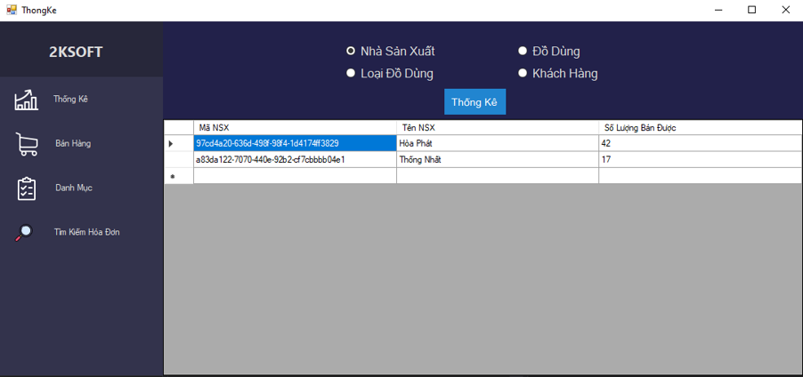
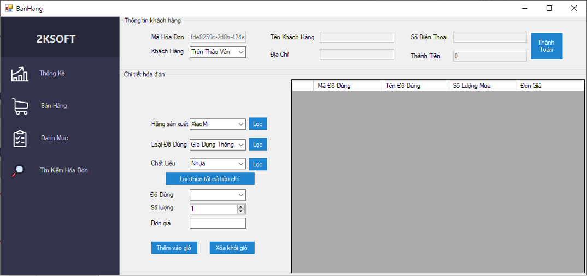
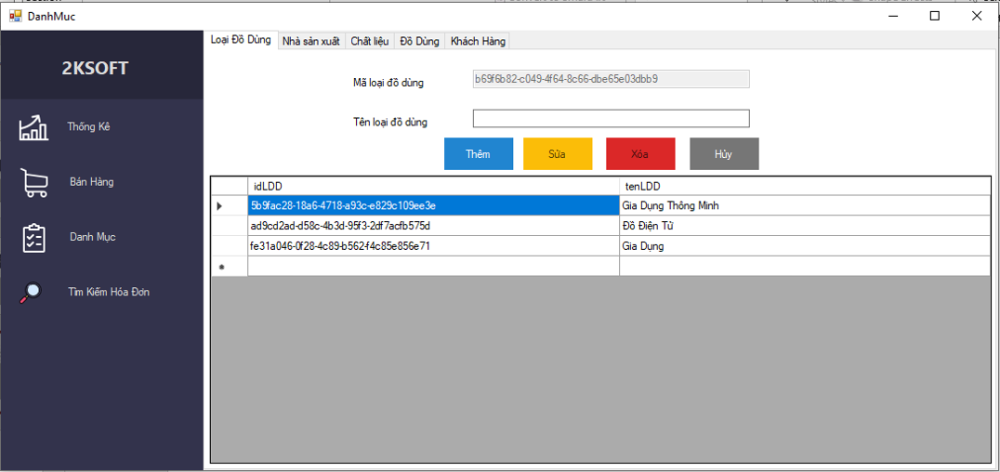

# Stack in the project

| Screen      | Graphic | Event Used | Stack     |
| :---        |    :----:   |     :----:  |         ---: |
|      |  Main,slide menu      |   | Loading FORM inside another FORM  |
|      |  Group, Radio Button, DatagridView      |  Click(Button),  |  Classify by (NhaSanXuat, DoDung, LoaiDoDung, KhacHang), SQL, SQL SERVER, ADO.NET  |
|      |  Group, Button, comboBox, DatagridView, TextBox | Load (load data initialize for elements),CellClick(choose items to update or delete),  Click (CRUD with database) , RowsAdded (reloaded into money by item changes), RowsRemoved(reload into money by item changes),  SelectedIndexChanged (choose id from value comboBox),CellValueChanged (update into money)  | Validate input data for all events,  SQL, SQL SERVER, ADO.NET, UUID(Universally unique identifier - Auto generate id)  |
|      |  Group, Button, DatagridView, TextBox |  Load (load data initialize for elements), Click (CRUD with database), CellClick(choose category to update or delete)   | Validate input data for all events, SQL, SQL SERVER, ADO.NET, UUID(Universally unique identifier - Auto generate id)   |
|      |   Button, DatagridView, DateTimePicker, TextBox |  Load (load data initialize for elements), Click (CRUD with database), CellClick(choose user to view history bought )   | Validate input data for all events, SQL, SQL SERVER, ADO.NET   |
